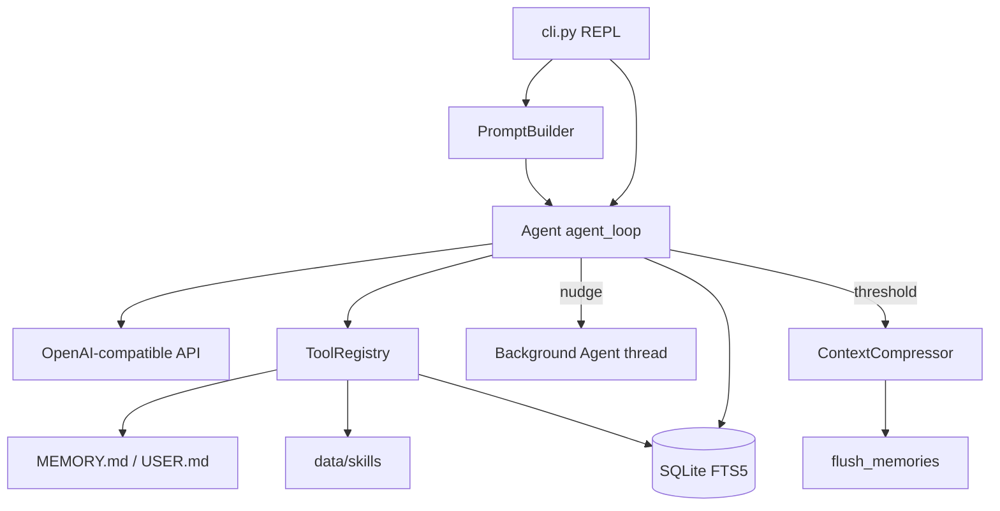

# mini_hermes
2000行代码拆解Hermes，从零Python实现Hermes自进化Self-Improving Agent


## 1. 目录结构与主要模块
```
d:\GitLab_agent58evolver\mini_hermes\
├── cli.py                          # 唯一应用入口（REPL）
├── config.yaml                     # 模型 / 学习循环 / agent / prompt_caching
├── agent_loop.py                   # Agent 类：主循环 + 后台复习
├── tool_calling.py                 # Structured vs Text 工具调用策略
├── requirements.txt
├── setup.sh
├── README.md / README_EN.md
├── tools/
│   ├── tool_registry.py            # 全局工具注册表
│   ├── file_tools.py               # read_file / write_file（需 import 才注册）
│   └── terminal_tool.py            # terminal（同上）
├── memory/
│   ├── persistent.py               # MEMORY.md / USER.md
│   └── memory_tool.py              # memory 工具 + 注册
├── skills/
│   ├── loader.py                   # SKILL.md 发现与索引
│   └── skillmanager_tool.py        # skills_list / skill_view / skill_manage
├── sessionsDB/
│   ├── session_db.py               # SQLite + FTS5
│   └── recall_CrossSession.py      # 跨会话检索 + LLM 摘要
└── contextengineering/
    ├── prompt_builder.py           # 系统提示组装
    ├── prompt_caching.py           # Anthropic cache_control
    ├── compression.py              # 中间段压缩
    └── flush_memories_beforecompression.py
```
运行时数据（`.gitignore` 的 `data/`）：`state.db`、`MEMORY.md`、`USER.md`、`skills/`。

---

## 2. 各模块职责
| 模块 | 作用 |
|------|------|
| **Agent 循环** (`agent_loop.py`) | 用户消息 → LLM → 解析 tool calls → 执行 → 循环至无工具或达 `max_iterations`；可选压缩、prompt caching；回合结束后按计数触发**后台线程**做 memory/skill 复习。 |
| **Tool calling** (`tool_calling.py`) | `StructuredStrategy`（OpenAI `tools` API）与 `TextStrategy`（系统提示注入 + 正则解析）；`strategy_for_model()` 按模型名启发式选择。 |
| **Tools** (`tools/*`) | `ToolRegistry` 注册 schema + handler；`cli.py` **仅 import** `memory.memory_tool`、`skills.skillmanager_tool`，故默认只有 memory/skills 类工具可用。 |
| **Memory** | **持久层**：`PersistentMemory` 读写 `MEMORY.md`/`USER.md`（会话启动时冻结进 system prompt，写入不刷新 prompt）。**情节层**：`SessionDB` 存消息 + FTS5。**召回**：`SessionRecall` FTS 搜索 → 按 session 分组 → 辅助 LLM 摘要。 |
| **Skills** | `SkillLoader` 扫描 `data/skills/**/SKILL.md`（YAML frontmatter）；`skill_manage` 等工具 CRUD；系统提示里只有技能索引（渐进披露）。 |
| **SessionsDB** | 表名 `sessionsDB`/`messages`/`messages_fts`；`append_message` 持久化对话；`search` 供 recall 与 `memory(search)`。 |
| **Context engineering** | `PromptBuilder` 拼 identity + memory + skills + 行为指引；`ContextCompressor` 超 50% 窗口时 head+摘要+tail；压缩前 `flush_memories` 给 agent 一轮只带 memory 工具；`apply_prompt_caching` 可选 Anthropic 断点。 |
| **Gateway** | **无实现**。仅在 `prompt_caching.py` 注释中提到「兼容 gateway」；实际是直连 `OpenAI` 客户端 + `config.yaml` 的 `base_url`。 |
| **Config** (`config.yaml`) | `model`（api_key、base_url、model、max_tokens）、`aux_model.max_tokens`（recall 摘要）、`learning` 间隔、`agent.max_iterations`、`prompt_caching`。 |

---

## 3. 关键入口点

| 入口 | 说明 |
|------|------|
| **`cli.py` → `main()`** | 唯一生产路径：读配置 → 建 client/SessionDB/Recall/Memory/Skills → **一次性** `PromptBuilder.build()` → `Agent` → REPL。 |
| **`if __name__ == "__main__"`** | 在 `cli.py` 末尾，无 `main.py`。 |
| **副作用注册** | `import memory.memory_tool` / `import skills.skillmanager_tool` 向 `registry` 注册工具。 |

REPL 斜杠命令：`/mem`、`/skills`、`/tools`、`/contextengineering`、`/sessionsDB`；`exit`/`quit` 结束并 `end_session`。

---

## 4. 相对「完整 Agent」缺失或不完整之处

**已实现（核心教学链路）：** 多轮 tool loop、双策略 tool calling、持久记忆文件、SQLite+FTS、跨会话 recall、技能 CRUD、学习 nudge + 后台复习、上下文压缩 + 压缩前 memory flush、可选 prompt caching 注入。

**明显缺失或未接线：**

1. **无 HTTP/API gateway、无多通道**（仅终端 CLI）。
2. **`read_file` / `write_file` / `terminal` 未在 `cli.py` import** → 运行时很可能**没有**文件/终端工具（与 README「内置工具」不符）。
3. **无测试**（无 `tests/`、`pytest`、`unittest`）。
4. **无观测性**：tracing、metrics、结构化日志、工具审计沙箱。
5. **无权限/沙箱**：`terminal`/`read_file` 无路径限制；`run_terminal` 使用 `shell=True`。
6. **系统 prompt 冻结**：memory/skills 写入后**不重建** system prompt；`PromptBuilder` 注释写「压缩后重建」但代码未做。
7. **`/model` 切换模型** 在 `cli.py` 中整段注释掉；`requirements.txt` 的 `pick` 几乎未用。
8. **Prompt caching**：`provider`/`base_url`/`log_usage` 配置了但 **`_caching_provider` 未用于门控**，`_log_usage` 未使用；文档中的 `_should_apply_prompt_caching()` **不存在**。
9. **`config.yaml` 中 `learning.flush_min_turns` 标注「没用」**；`flush_memories` 的 `min_turns` 默认 0。
10. **无会话恢复**：新启动总是 `create_session`，不能从 DB 恢复进行中对话。
11. **无 MCP / 浏览器 / 子 agent 编排**（对比 Cursor/完整 Hermes）。
12. **后台复习**：daemon 线程、无取消/去重/错误对用户可见；与主 agent 共享同一 `system_prompt` 快照（不含新技能索引）。

---

## 5. 测试覆盖

**无。** 全仓库无 `test_*.py`、`tests/`、`pytest.ini`，`grep` 无测试相关匹配。

---

## 6. 代码气味与架构缺口

| 问题 | 位置/说明 |
|------|-----------|
| **调试残留** | `recall_CrossSession.py` 中 `print("----recall：" + str(seen))`；`cli.py` 大段注释掉的示例输出。 |
| **全局可变单例** | `registry` + `memory_tool`/`skillmanager_tool` 的 `set_*` 全局注入，不利于测试与多实例。 |
| **静默失败** | `_persist_message`、FTS insert、后台 review、`flush_memories` 多处 `except: pass`。 |
| **策略与模型不匹配** | `deepseek-v4-pro-ali` 不含 `qwen`/`mistral` 等关键字 → 默认 **TextStrategy**，可能浪费原生 function calling。 |
| **安全配置** | `config.yaml` 含明文 API key（应环境变量/本地 secret，且不应提交）。 |
| **工具结果截断重复** | `Agent._execute_tool` 与 `ToolRegistry.execute` 各 50k 截断。 |
| **压缩估算粗糙** | 仅按字符/3.5 估 token，不含 tool_calls 体积。 |
| **FTS 与 messages 同步** | 仅 user/assistant 文本入 FTS；tool 消息不入索引。 |

---

## 7. 数据流（简图）


---

## 8. 依赖与运行
- **依赖**：`openai>=1.0.0`、`pyyaml>=6.0`、`pick>=2.0.0`（CLI 未用）。
- **启动**：`python cli.py`（或 `setup.sh` 建 venv）。
- **当前配置**：`prompt_caching.enabled: false`。 
conda create -n claude_code python=3.13.13 -c conda-forge -y
conda activate claude_code
d:
cd  \Github_romote\
dir
pip install -r requirements.txt

---
**结论：** mini_hermes 是结构清晰的 **Hermes 概念演示**（记忆三层、技能、学习循环、压缩），以 `cli.py` 为唯一入口；要成为「完整 agent」还需接上 file/terminal 工具、测试、gateway、prompt/技能热更新、安全沙箱，并清理占位代码与文档漂移。
## 参考+Companion blog post
See [Build a Mini Hermes Agent From Scratch](https://mesuvash.github.io/projects/mini-hermes/) for a detailed walkthrough of the design decisions behind each component.
all：
- 官方参考实现思路[NousResearch/hermes-agent](https://github.com/NousResearch/hermes-agent) — 
- [Anthropic Claude Code 架构文档](https://docs.anthropic.com/en/docs/claude-code) — Agent 设计的工业实践
- [LangChain Agent 概念](https://python.langchain.com/docs/concepts/agents/) — 对比参考
- [OpenAI Function Calling](https://platform.openai.com/docs/guides/function-calling) — 工具调用协议标准
- [Honcho 用户画像](https://github.com/plastic-labs/honcho) — 用户建模参考
all：https://github.com/search?q=mini+hermes&type=repositories
参考：https://github.com/mesuvash/mini_hermes
参考：https://github.com/tangfei-china/mini-hermes
参考：https://github.com/JerryZ01/hermes-mini ----


